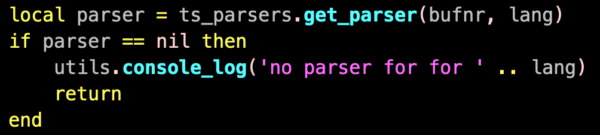
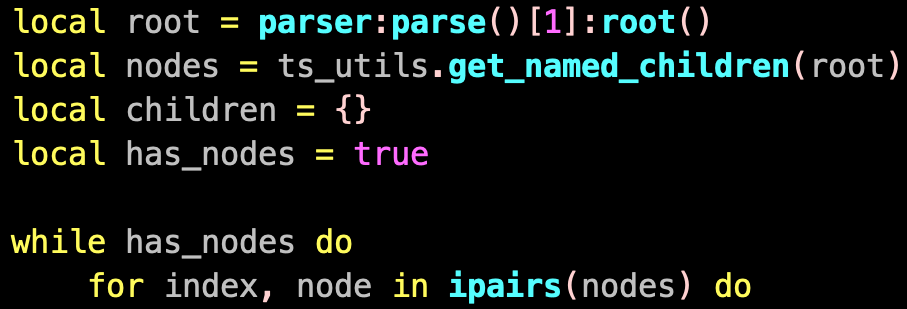

# Biscuits (technical)

## Init

## Config

## Options

## Adding the Virtual Text

## Highlight Groups

A container for all Virtual Text instances

Use your own or you will break other plugins

## Treesitter (parser)

## Treesitter (nodes)

## Use the right hook

if your plugin is slow you will make nvim slow

nobody likes that

